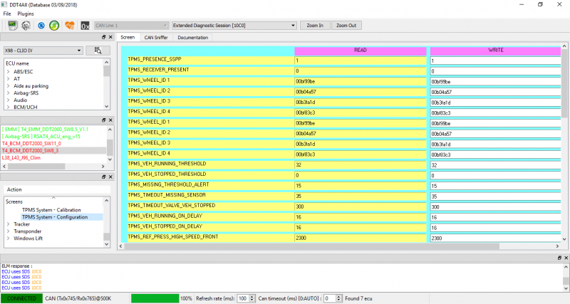

# Renaul Clio

## Disable TPMS  [Source](https://www.renault-klub.hr/forum/index.php?/topic/55395-tpms-ga%C5%A1enje/)

 So I won't go into detail, you need to have DDT4ALL with bases.
It's easy to find by googling.

In the initial window, select the correct serial port and select Connected mode.
Once the main window is launched select the car model, in this case it is X98 - CLIO IV,
and click the magnifying glass to scan the available ECUs.
After scanning them all they will become available for selection, for TPMS select
T4_BCM_DDT2000 and under TPMS select TPMS System - Configuration.

I recommend taking a screenshot so you always know what was done at the factory,
then enable Expert Mode and enter "0" in the WRITE field for TPMS_PRESENCE_SSPP and click on Write/Send.
Then the sensor fault should appear immediately if it hasn't already.
At the factory, it looked like the first picture.

Then you need to go to the Instrument panel, i.e. for me it's Tableau de bord.
Then on Configuration page 2, there you have TPSM Type that needs to be changed to
Not present, of course Expert mode must be enabled first.
Then on Write and finally at the bottom you have 2 buttons,
in my case the right one is the one that needs to be pressed for programming,
it says Prise en compte des configurations.
This will program your board in a few seconds and then the TPMS error should disappear.
It's a bit of a clunky tutorial because I didn't take a bunch of pictures, I hope you get the idea.
It is a very powerful tool, but almost nothing is explained or user friendly.

Now I'm looking at how to turn it on so that my dipped headlights come on automatically.

